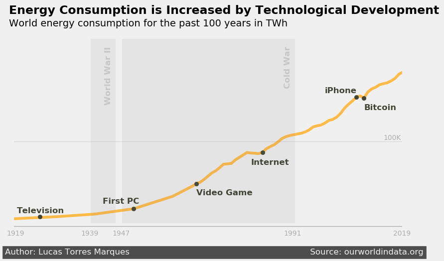

# Data Visualization: Energy Consumption




> This project is a storytelling with data, with the objective to show how technology development influenced energy consumption for the last 100 years, and how sustainable energy are growing fast in the last 25 years. Coding Best Practices, Writing Clean Code, Refactoring Code, Efficient Code and Documentation techniques were applied and tested with PCQA - **Pylint**.

## 💻 Requirements

Before starting, double check if you meet all the following requirements:
* You have `<Python 3.9>` installed and running.
* You have a `<Windows / Linux / Mac>` machine.

## 🚀 Getting started to energy-consumption

To reproduce the results from this project, first clone the repository:

HTTP option:
```
git clone https://github.com/Lucastmarques/mlops-course-U1T3.git
```

SSH option:
```
git clone git@github.com:Lucastmarques/mlops-course-U1T3.git
```

Also, make sure you have access to a Python 3.9 Interpreter by running:
```
python3 --version
```

Or:
```
python --version
```

## ☕ Using energy-consumption

To run energy-consumption, follow these steps:

```
pip install -m requirements.txt
```

Make sure you are already in the **energy-consumption** directory before running the above command.

Then you can simply run the scripty by using:
```
python global_energy_consumption.py
```

Or:
```
python3 global_energy_consumption.py
```

You can also verify if all Coding Best Practices, Writing Clean Code, Refactoring Code, Efficient Code and Documentation techniques were applied by running:
```
pylint global_energy_consumption.py
```

Be free to run this command for all scripts (.py files) in this repository.

## 📝 License

This project is under license. See the [LICENSE](LICENSE.md) file for more details.

[⬆ Back to the top](#mlops-course-U1T3)

